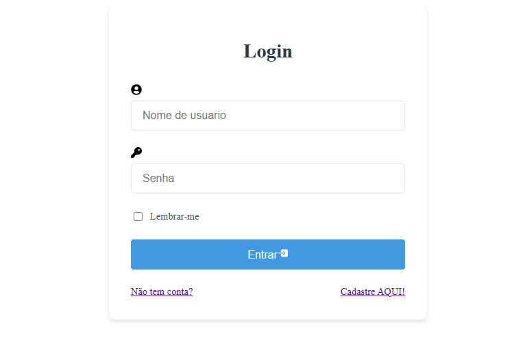

## *Introdução*  

  

Bem-vindo ao desenvolvimento da interface de login, um componente essencial para sistemas que requerem autenticação de usuários. Esta tela serve como o primeiro ponto de contato entre o usuário e a plataforma, sendo fundamental para garantir uma experiência intuitiva, segura e eficiente.  

## *Objetivo do Projeto*  
Criar uma interface de login que:  
✔ *Priorize a usabilidade* – Com campos claros e fluxo intuitivo.  
✔ *Mantenha a simplicidade* – Eliminando elementos desnecessários.  
✔ *Seja acessível* – Seguindo boas práticas de design inclusivo.  
✔ *Evite erros comuns* – Como textos mal formatados ou interações confusas.

#   Visual Studio Code 

  

#     Zerogallo / projetoLogin

 https://zerogallo.github.io/projetoLogin/ 

